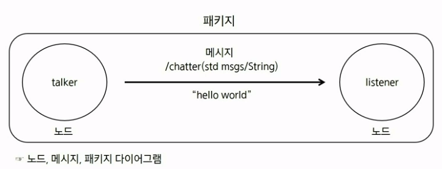
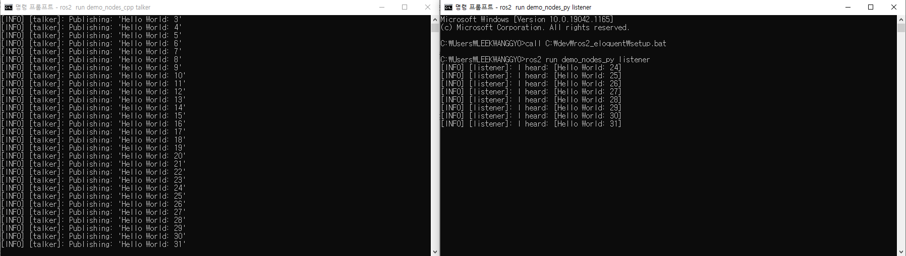
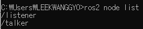
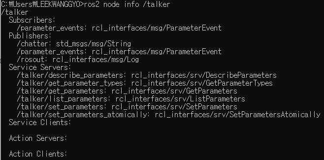
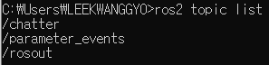
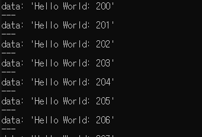
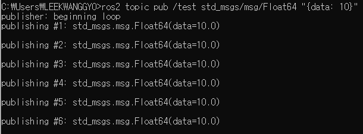

# IoT
# `08.24`

# ROS(Robot Operating System)

요즘 스마트홈은 서버에 연결되어 원격으로 제어하거나 타이머를 맞춰 놓는 간단한 형태가 아니라 집에서 로봇이 돌아다니는 형태로 바뀜

→ 그곳에 들어가는 SW의 개발을 도와주는 역할을 한다.

- 로봇을 개발하는데 있어 필수적인 라이브러리 제공
- Application 부분만 개발하면되기 때문에 개발 시간, 비용 절약 효과

- 메타 운영체제라고 한다. OS 위에 설치하고 OS에 있는 기능들을 이용하여 스케줄링, 감시, 에러처리 등을 처리한다. → 이러한 컨셉을 미들웨어, 소프트웨어 프레임워크라고 한다.
  - 새로운 OS를 배우는게 아니라 ROS에서 만들어놓은 Client Library를 이용해서 원하는 기능을 수행하는 Node(프로그램)을 만드는 것

:white_check_mark: TCP/UDP → DDS(Data Distribution Service) :  네트워크에 존재하는 통신 객체들을 자동으로 검색하고 데이터의 연관성에 따라 선택적으로 연결을 수행 → 다수의 로봇, 장치를 연결하기에 효과적이다.

:white_check_mark: 기존은 Master라는 노드가 직접 연결을 해줬다면 ROS2는 Master가 따로 존재하지 않고 분산되어 처리, Master가 죽어서 모든 시스템이 마비되는 걱정을 하지 않아도 됨

## ROS 용어

1. 노드

   노드는 ROS에서 최소 단위의 실행 프로세스를 가리키는 용어, 즉 하나의 파이썬 스크립트는 하나의 노드이다.

2. 메시지

   노드에서 다른 노드로 정보를 전달하는 단방향, 비동기식, 연속적 통신 → 기능 별로 노드를 나눠서 만들기 때문에 편리한 기능이다.

3. 패키지

   ROS 소프트웨어의 기본 단위, 패키지는 노드, 라이브러리, 환경설정 파일들을 통합하는 최소의 빌드 단위이며, 배포 단위이다.

### 메세지 통신

노드 간 데이터 교환을 쉽게 해주는 것을 메시지 통신이라고 하며 ROS의 핵심 기능이다.

- Talker는 메시지를 발행(Publish)하는 노드, Listener는 메시지를 구독(Subscribe)하는 노드
- 2가지 요소를 알면(Topic, Type) 발행, 구독 가능
- Topic: chatter, Type: std msgs/String, 내용 : hello world
- 토커에서 리스너로만 보낸다(단방향 통신)
- 메시지를 리스너가 원할 때만 받는 것이 아니라 토커가 보낼 때마다 받는다. → 받고 싶지 않아도 계속 받아지기 때문에 `비동기식 연속성 통신`이라고 한다.
- 하나의 노드에서만 받을 수 있는 것이 아니라 다른 노드에서 Subscriber를 만들어서 가능하다(/chatter(std msgs/String)
- 패키지는 여러개의 노드를 가질 수 있다.

### 통신 방법

1. setup.bat 파일을 호출해서 터미널에서 ROS의 기능을 사용할 수 있게 해야 한다(새로운 터미널을 열 때마다 호출 해야한다.)

   call C:\dev\ros2_eloquent\setup.bat → 아무것도 뜨지 않으면 ROS가 잘 설치되었고 사용할 수 있다는 것

2. Node를 2개 사용해야하기 때문에 새로운 터미널을 열어야함, 이후 setup.bat을 다시 호출 해야한다.

3. 메세지를 퍼블리시하는 토커를 실행

   ros2 run demo_nodes_cpp talker → 토커에서 메시지를 퍼블리시 하고 있다고 출력됨(받는 노드가 없어도 계속 퍼블리시 가능)

4. 리스너를 실행

   ros2 run demo_nodes_py listener → 키는 순간 퍼블리시에서 보내는 메시지를 받음

⇒ 메시지 통신을 시켜주는 기능 → 나중에는 센서 데이터, 주행 명령어, 인지 결과 등 다양한 데이터를 메시지를 통해서 보냄

**결과**

## 노드와 메시지 관련 명령어

현재 어떤 노드가 실행되고 있고 어떤 메세지가 나오고 있으며, 데이터는 무엇인지, 어떤 노드에서 어떤 노드로 메시지가 흘러가는지 파악 가능하다.

→ 디버깅에 편리하다.

### 노드 명령어

- ros2 node list : 실행되고 있는 노드 이름 출력

  

- ros2 node info /talker : talker 노드의 통신 상태, 내용 출력\

  

### 토픽(메시지) 명령어

- ros2 topic list : publish 되고 있는 메시지 리스트 출력

  

  현재 talker에서 publish되고는 chatter라는 topic이 있다라는 것을 보여준다.

  밑에 두개는 ROS가 실행되면 기본적으로 나오는 메시지라 신경 안써도 된다.

- ros2 topic echo /chatter : /chatter의 메시지 내용을 출력

  

- ros2 topic pub /test std_msgs/msg/Float64 "{data: 10}"

  

## ROS 장점

- 노드간 메시지 교환 방법으로 복잡한 프로그램을 나눠 공동 개발 용이
  - 예) 자율 주행 차량
  - 하나의 노드(스크립트)에서 알고리즘을 개발할 때 인지, 판단, 제어를 나눠서 개발한다고 하면 서로 스크립트를 계속 공유하면서 개발하거나 앞단의 알고리즘이 개발이 끝나야 다음 사람이 다음 알고리즘을 개발할 수 있다. 또한 앞단에서 개발한 알고리즘이 뒤에 있는 알고리즘의 성능에도 영향을 미칠 수 있다. ⇒ 하나의 노드에서 개발하기 때문에 발생하는 문제
- ROS를 사용한다면 서로 노드간의 주고받을 토픽과 메시지 타입만 알려주면 결과를 전송해줄 수 있기 때문에 기능별로 노드를 나눠서 개발할 수 있다. 공동으로 작업하는대도 서로에게 전혀 영향을 주지 않는다.
- 기능별로 노드를 만들었기 때문에 문제 발생 시, 어느 노드에서 메시지가 나오지 않는지 파악하면 쉽게 해결할 수 있다.
- 로봇 소프트웨어를 개발할 때 라이다, 카메라, GPS와 같이 센서 데이터 받는 것에 대한 걱정할 필요가 없음
  - 로봇에 주로 사용하는 각종 센서들은 제조사에서 ROS로 만들어서 제공하고 있거나 누군가 이미 만들어 놓은 센서 드라이브를 깃허브 같은 곳에 공유하고 있기 때문에 패키지만 받아서 빌드하면 데이터를 받을 수 있다 → 개발 시간 단축
- ROS에서 만들어 놓은 여러가지 표준 메시지 타입들이 있다. STD msgs, NAV msgs, SENSOR msgs 등 사용자가 미리 사용할만한 타입들을 만들어 놓았다. → 사용자가 따로 메시지 타입을 정의해서 사용할 필요가 없다.
- 강력한 시각화 도구가 있다.
  - RQT
    - rqt topic monitor : 현재 나오고 있는 토픽들을 모니터링 할 수 있는 토픽 모니터가 있다(토픽 관련 명령어의 시각화 버전)
    - rqt graph : 어떤 노드에서 어떤 토픽이 나오고 어떤 노드로 들어가고 있는지 한눈에 볼 수 있게 해주는 시각화 도구(전체적인 시스템을 한눈에 파악할 때 사용) → 우리가 설치한 버전에는 설치가 안되어있음
  - RVIZ : 미리 만들어져있는 표준 메시지 타입을 사용하면 바로 시각화해서 만들어주는 툴
  - ROSBAG : 시각화 도구 외에도 현재 퍼블리시 되고 있는 메시지들을 기록했다가 재생할 수 있는 도구
    - 실제 테스트했던 환경에서 나온 메시지들을 가지고 있다가 원하는 때에 플레이해서 사용할 수 있다. 마치 실험 환경에 있는 것과 같이 코드를 개발할 수 있다.
    - 반복적인 실험으로 알고리즘 개발에 용이
    - 실제 실험 환경에 있는 것과 같이 코드를 개발 및 수정 가능

**ROS 장점 정리 ⇒ 오로지 개발자가 소프트웨어에 집중할 수 있게 개발에 필요한 다양한 툴을 제공 → 시간과 비용 절약**

 

# `08.25`

# Navigation

로봇에서의 네비게이션은 목적지까지의 경로를 탐색하고 도착하는 것이다.

4가지 요소 : 위치, 센싱, 지도, 경로

## Mapping(맵 생성)

- 2D 라이다 센서를 이용해 주변 환경에 대한 맵을 만든다.
- Mapping 과정
  1. 로봇을 움직이고, 움직인 거리를 추정하고, 이전 위치와 누적해서 현재 위치를 계산한다.(Odometry)
  2. 현재 위치에서 들어오는 센서 데이터를 이전에 저장한 센서데이터와 합친다.
  3. 맵을 만들고 싶은 공간을 모두 돌아다니면서 위의 과정을 반복한다.

:heavy_check_mark: 맵 제작 과정에 로봇이 생각한 이동거리와 실제거리가 다르면 맵이 제대로 만들어지지 않음 → 로봇이 움직인 거리를 정확하게 추정하는 것이 중요하다.

## Localization(위치 인식)

- 맵에 로봇의 위치를 표시하는 것을 Localization이라고 한다.
- Localization 과정
  1. 맵을 읽어온다.
  2. 초기 위치를 설정한다.
  3. 로봇을 이동시키면서 움직인 거리를 추정하고, 이전 위치와 누적해서 현재 위치를 계산한다.
  4. 예측한 현재 위치에서 들어올 라이다 데이터와 현재 들어오고 있는 라이다 데이터를 비교한다.
  5. 데이터가 같다면 예측한 현재 위치를 확정한다.
  6. 위의 3 ~ 5 과정을 반복한다.

:heavy_check_mark: 추정한 Odometry에서 나아가 라이다 데이터와 우리가 가지고 있는 맵을 이용해서 위치가 맞는지 확인하는 과정이 추가됨

## Path Planning

- Path는 로봇이 존재할 수 있는 위치의 집합이다.
  - Path를 표현하는 방법에는 점으로 표현하는 방법과 그리드로 표현하는 방법이 있다.
- 방법
  1. 데이터를 활용해 경로를 만드는 법(동적)
     - 원하는 목적지를 선택하면 경로가 만들어진다(경로 탐색 알고리즘을 이용)
     - 필요할 때마다 즉시 뽑아내서 사용
  2. 직접 주행을 통해 경로를 만드는 법(정적)
     - 출발지, 목적지가 항상 같다.
     - 경로를 여러개를 만들어 놓음(같은 경로만 갈 수 있으므로)

:heavy_check_mark: 동적 방법은 맵 데이터, 읽어오기, 알고리즘 등이 있어야 하므로 어렵다. 우리는 정적 방법을 이용할 예정

## Sensing

- 장애물 인지센서(카메라, 라이다, 초음파, 적외선)를 이용해 장애물을 인지하는 것이다.
  - 장애물 인지를 통해 충돌을 피할 수 있다.

## Mapping & Localization 구현의 기본 개념

### Odometry

- 로봇이 움직인 이동량을 추정해서 누적한 것 → 절대적인 위치가 아니라 상대적인 위치, 내가 기록하기 시작한 위치를 기준
- 이동량은 로봇의 속도를 이용해 구한다. → 움직임 이동량을 누적하면 Odmetry가 된다. 속도에 대해서 적분
- 로봇의 속도는 두가지로 이루어져 있다.
  - 선속도 : 이동하려는 성분의 속도(속도는 같은데 바퀴 방향이 반대이면 선속도는 없고 제자리에서 회전만 하는 각속도가 생김)
  - 각속도 : 회전하려는 성분의 속도(좌우 바퀴의 속도 차이가 나게 되면 생성)

- 속도를 누적(적분)하면 이동량이 된다.
- 로봇은 회전을 하기 때문에 회전에 대한 값을 고려해준다.
  - 로봇이 바라보고 있는 방향(헤딩)에 따라 이동하는 축이 달라진다. → 위치를 이야기할 때 3가지를 말한다. x, y축으로 이동한 위치, 로봇이 바라보고 있는 방향(헤딩)

### Odmetry를 이용한 경로 생성 방법

- Odmetry를 이용하여 로봇이 주행할 경로를 만들 수 있다.
  - 계산한 Odmetry를 기록하면 경로가 된다.
  - 상대 위치를 이용해서 만드는 것이기 때문에 취약점이 있다.

### Odmetry의 취약점

- 동작하기 위한 조건이 있다.
  - Odmetry 기반 경로는 시작하는 로봇의 위치와 자세(x, y, δ)가 경로를 기록했을 때 로봇의 위치와 자세가 항상 같아야 한다.
- 측정에 있어 오차가 존재한다.
  - 누적 오차가 있기 때문에 이동할수록 오차가 커진다.
  - 회전에 대해 오차가 크게 발생한다.

# 좌표계와 물체의 자세

좌표계 : 공간상에서 물체의 위치를 표현하는 체계

- 직교 좌표계, 원통 좌표계, 구면 좌표계 등 목적에 따라 여러 좌표계로 물체의 위치와 자세를 표현할 수 있다.
- 센서들은 각각 다른 좌표계를 사용하고 있다.

## 기준 좌표계

- 물체의 위치를 나타낼 때 사용한 좌표계를 기준 좌표계라고 한다.
  - 나를 기준으로 형을 나타낸 표현과 동생을 기준으로 형을 나타낸 표현은 다르다.
    - 나 기준의 형 : 우측으로 3m, 동생 기준의 형 : 우측으로 6m
  - 어떤 기준으로 물체의 위치를 표현하냐에 따라서 같은 위치의 물체라도 다르게 표현될 수 있다.
- 로봇에서는 하나의 좌표계가 아니라 여러 개의 좌표계를 사용한다.
  - 측정된 값은 측정 센서를 기준으로 얻어진 거리이기 때문에 바로 사용하지 않는다.
  - 로봇 관절이 꺾인 각도에 따라 장애물의 위치가 완전히 달라지기 때문
  - 로봇팔에서는 움직이지 않는 좌표계를 기준으로 놓고 사용한다. 즉 바닥에 붙어있는 base link를 기준으로 사용한다.

- 기준 좌표에 따른 라이더 데이터 표현 방법

  - map이라는 기준 좌표계는 우리가 Odometry를 시작하는 곳, 로봇의 위치가 (0, 0)이 되는 위치
  - base link는 로봇 좌표계의 이름으로 로봇의 움직임에 따라 map 좌표계 위에 있는 로봇의 위치가 변한다.
  - 레이저는 로봇에 달려있는 라이다 좌표계를 의미한다.

  - RVIZ는 시각화 툴로 ROS의 좌표계(TF2) 기능을 사용하면 원하는 좌표계를 기준으로 놓고 데이터를 볼 수  있다.
  - TF2를 기능을 사용하면 좌표계 간의 거리, 회전 각도 등을 정의할 수 있게 해준다.
    - http://wiki.ros.org/tf2/Tutorals

## 물체의 자세

- 기준 좌표계에서 물체가 얼마나 회전되어 있는지를 나타낸다.
  - 같은 위치의 물체라도 다른 자세를 취할 수 있다.
  - 표현방법은 오일러 각, 쿼터니언 두가지가 있다.

### 오일러각

- 물체의 자세를 Roll Pitch Yaw(ex. 헤딩) 3가지로 표현하는 방법
- 직관적으로 이해하기 쉽다.
- 몇몇 자세를 표현하지 못하는 짐벌락 현상이 있다.

### 쿼터니언

- 물체의 자세를 X Y Z W 4가지 변수로 표현하는 방법
- 직관적으로 판별하기 어렵다(몇 도 돌았는지 표현 불가)
- 모든 자세를 표현할 수 있으며 빠른 연산처리가 가능하여 컴퓨터 그래픽에서 주로 사용하는 좌표계다.
- ROS에서 자세를 나타내는 메시지들은 모두 쿼터니언을 사용한다.
- 알고리즘에서 연산할 때에는 오일러각을 사용하여 연산하고 메시지를 보낼때는 쿼터니언으로 변환해서 보낸다.

### 오일러각, 쿼터니언 실습

- 굳이 변환 수식을 구현할 필요 없이 미리 구현되어 있는 squaternion이라는 모듈 사용
- 변환 확인 참고 사이트 : https://quaternion.online/

## ROS 실습

- ROS에서 Odometry데이터를 전송 할 수 있다.
  - nav_msgs/Odometry 메시지 타입 이용
  - 사용해야하는 메세지의 필드
    - header의 frame_id : 기준좌표계의 이름
    - pose : positon(위치)과 orientation(쿼터니언)으로 이루어져 있다.
  - https://docs.ros.org/en/noetic/api/nav_msgs/html/msg/Odometry.html
- ROS에서 Odometry 예상 결과 확인 방법
  - rviz에서 시각화해서 확인한다.
  - rviz 실행
    - rviz2
    - 왼쪽 하단 Add 버튼을 클릭한다.
    - By topic 탭을 클릭한다.
    - Odometry를 클릭한다.
    - OK 버튼을 클릭한다.

## ROS에서의 Path

- ROS에서 Path 데이터를 전송 할 수 있다.
  - nav_msgs/Odometry 메시지 타입 이용
  - 사용해야하는 메세지의 필드
    - header의 frame_id : 기준좌표계의 이름
    - pose : 경로점들을 가지고 있는 배열(경로점들은 positon(위치)과 orientation(쿼터니언)으로 이루어져 있다.)

 

# `08.26`

# 종/횡방향 제어

## 제어

- 대상 물체를 원하는 대로 조작하는 것

  ex) 리모컨으로 TV 조작, 게임 컨트롤러로 캐릭터 조작

### 로봇의 제어

- 로봇을 원하는 위치, 상태(속도, 가속도 등)로 조작하는 것
  - 로봇에 달린 모터를 원하는데로 움직일 수 있어야 한다.

## 종방향 제어

- 물체가 바라보는 방향 기준으로 수평한 방향의 제어를 말한다.
  - 터틀봇에서는 앞/뒤로 움직이는 제어를 종방향 제어라고 한다.
  - 2강에서의 선속도 제어

### 제어을 위한 기본 개념 : 이동거리 - 속도 - 가속도의 관계

- 이동거리, 속도, 가속도 3가지는 이동체의 움직임을 표현하거나 분석하는데 있어 가장 기본적인 단위들이다.
- 3가지 중 최소 1가지만이라도 알 수 있는 경우 미분/적분을 통해 나머지 2가지를 연산 및 추정할 수 있다.

### 피드백 제어

- 현재속도와 목표속도 차이에 따라 가속 또는 감속을 한다.

  - 가속도 제어 : 차량의 엑셀, 브레이크
  - 속도 제어 : 직접 속도를 줘서 제어

- 피드백 제어를 통해 목표속도에 도달할 수 있다.

  - 현재속도를 알고 목표속도로 맞춰가는 것

  - ON/OFF 제어

    - 단순히 목표속도에 도달하기 위해 조작을 ON/OFF 하는 제어
    - 목표속도로 완벽하게 수렴하지 못한다(근처에서 진동)
    - 정밀한 제어에는 적합하지 않다.

  - PID 제어

    - P(Proportional)제어

      - 오차는 목표속도 - 현재속도이다.
      - 오차에 비례하는 조작량을 가한다.(오차가 적을수록 조작량이 줄어들음)
      - 오차를 완전히 줄일 수 없다(목표 근처에서 켰다껐다를 반복)

    - PI(Proportional-Integral)제어

      - 비례제어, 적분제어이다.
      - P제어 조작량 + 오차를 누적한 조작량을 더해서 제어한다.
      - 오차를 완전히 줄일 수 있다.

    - PID(Proportional-Integral-Defferential)제어

      - 원하는 값에 도달하기 위한 기초적인 피드백 제어 방법 중 하나이다.

      - 에러에 대해서 미분한 값을 조작량에 더한다. → 이전 에러에서 현재 에러를 시간으로 나누게 되면 시간을 곱하는 적분항보다 훨씬 값이 커진다. → 급격한 에러변화에 조작량이 크게 영향을 주어 빠르게 목표로 수렴하게 해준다. ⇒ PID를 적절히 조정

      - P, PI, PD, PID 등 제어 대상에 맞게 선택해서 사용할 수 있다.

      - PID 제어는 수식이 매우 간단하고, 구현 난이도 대비 목표치 추종이나 외란 감쇄 효과에 탁월한 성능을 가진다. → 대부분 로봇의 종방향 제어에 사용

      - 적절한 이득값(Kp, Ki, Kd) 조절이 필요하다.

      - 그래프

        u(t) : 아웃풋(제어 입력값)

        e(t) : error

        K : 각 항의 이득값으로 각 항이 조작량에 미치는 값을 조절 → 이 값을 잘 조절해야 목표치에 빠르게 안전하게 도달할 수 있는 제어기를 만들 수 있다.

## 횡방향 제어

- 물체가 바라보는 방향 기준으로 수직한 방향의 제어를 말한다.
  - 각속도를 이용한다.
  - 터틀봇에서는 좌/우로 움직이는 제어를 횡방향 제어라고 한다.

### 횡방향 제어 방법

- 기하학적 제어 방법과 모델링 기반 제어 방법으로 나뉜다
- 모델링 기반 제어는 제어 대상을 모델링 해야 하기 때문에 어렵고 고려 해야할 것이 많다.
- 기하학적 제어 방법(수식이 간단하고 적은 파라미터를 이용하여 쉽게 제어)
  - Follow the Carrot
    - 현재 위치와 목표지점까지의 오차 각도와 거리(직선)이용
  - Pure Pursuit
    - 현재 위치와 목표 위치 두점을 지나는 원을 이용
  - Stanley Method
    - 경로와의 오차 거리 및 조향 각도 오차 이용
  - Vector Pursuit
    - 나사 이론을 기반으로 원과 직선으로 구성

### 조향 장치에 따른 횡방향 제어 방법

- Pure Pursuit, Stanley Method, Vector Pursuit은 조향 장치가 있는 경우에 사용하기 좋다.
- 터틀봇은 조향장치가 없고 두 바퀴의 속도차이로 선회하는 스피드 스퀘어링 방법을 이용 → Follow the Carrot를 사용할 예정

### Follow the carrot

- 로봇의 위치, 경로점들을 가지고 경로를 따라갈 수 있는 각속도를 계산하는 방법

  기준점 X, Y(Odometry로 계산한 로봇의 상대위치)

  경로가 가장 가까운 지점 x0, y0

  사용자가 지정한 L 거리 만큼 떨어져 있는 xL, yL

  (x0,y0)에서 (xL, yL)간의 성분과 로봇 중심(X, Y)으로부터 (xL, yL)로 가는 직선의 사이각만큼 횡방향 제어를 하게 된다.

  (x0, y0)는 local_path의 첫번째 값이라고 생각하면 된다. → 따로 찾을 필요가 없다.

  L : 전방 주시 거리 → 얼마나 잘 설정하느냐에 따라 Follow the carrot의 성능을 결정

  - 속도에 비해 너무 짧게 설정하면 경로를 추정할 때 오실레이션(진동)발생한다.
  - 속도에 비해 너무 길게 설정하면 경로를 코너에서 먹고 들어가서 코너가 좁은 환경에서는 충돌할 수 있다.

  ✅ 적절한 L을 설정해야한다.

 

# Sensing and Collision Check

## Sensor

### Sensing의 필요성

로봇이 움직이는 환경은 동적인 환경이다.

- 사람이나 사물이 갑자기 나타날 수 있다.
- 경로 추종은 할 수 있지만 장애물에 대해서는 대응이 안된다.

### 라이다(Light Detection and Ranging)

- 빛을 쏘아서 거리를 측정하는 센서이다.
  - 돌아오는 시간을 측정
- 데이터의 정밀도가 높다.
- 파장이 짧아 날씨 조건에 약하다.
- 가격이 비싸다.

**라이다의 활용**

- 정밀한 라이다 포인트를 이용해 물체인지가 가능하다.
- 라이다 포인트 클라우드 맵을 만들어 위치인식에 사용할 수 있다.
- 빛의 반사도를 이용해 차선을 구분할 수 있다.
  - x, y 좌표 뿐만 아니라 Intensity라는 빛의 반사도 값을 알려준다.
  - 검은색은 반사도가 낮고 흰색은 상대적으로 높다.

### 카메라

- 빛(가시광선)을 이용해 이미지 영상을 얻는다.
- 색상정보는 얻을 수 있지만, 거리는 알 수 없다.
- 날씨 조건에 약하다.
- 저렴하다.

**카메라의 활용**

- 색상 정보를 활용해 다양한 물체를 인식하는데 사용한다.
- 반도체, 공장 등 공장의 검사장비에 사용한다.
- 딥러닝, 멀신러닝을 이용해 다양한 연구에 활용한다.

### 카메라와 라이다의 융합

- 카메라로 인지한 물체의 정확한 거리를 알 수 있다.

## 좌표 변환

- 필요한 이유 : 동일한 좌표계를 이용해야 로봇 알고리즘에 활용할 수 있다.
  - 로봇에서는 센서마다 서로 다른 좌표계를 갖느다.
  - 라이다는 극좌표계를, 로봇의  위치, 경로는 직교 좌표계를 사용한다.

### 극좌표계, 직교좌표계 변환

- 삼각함수를 이용하여 변환한다.

### 직교 좌표계 사이의 좌표 변환

- 기준을 어디에 두느냐에 따라 점들이 다르게 표현된다.
- 라이다 기준, 로봇 기준에 따라서 라이다 포인트들은 다르게 표현된다.
  - 로봇 좌표계로 변환하는 이유 : 로봇이 장애물에 대해서 대응을 하기 위해서
- 경로점의 기준 좌표계는 map이다.
- 라이다 포인트들을 map 좌표계로 변환해서 경로점과 거리비교를 통해 충돌체크를 할 수 있다.
- 경로점과 라이다 포인트를 비교하여 로봇이 주행하려는 경로에 장애물이 있는지 판단하기 위해서 → 경로점들은 map좌표계 기준으로 표현되어 있고 로봇은 map 기준으로 움직이기 때문에 움직이지 않는 map 기준으로 해야한다.
- 좌표계가 이동(Translation)만 되어 있다면 연산이 쉽지만, 회전(Rotation)이 같이 있으면 연산이 어렵다.
  - 직교 좌표계간 이동, 회전 연산을 한번에 계산해주는 행렬 : Translation & Rotation Transformation Matrix(RT Matrix)
- Translation & Rotation Transformation Matrix(RT Matrix)
  - 기준 좌표계를 Global, 기준 좌표계로 변환하고자 하는 좌표계를 Local이라고 한다.
  - 변환행렬을 이용하여 Global, Local 간의 좌표변환이 가능하다.

 

# Collision Avoidance

## 충돌 회피

### 충돌 회피의 종류

1. 맵, 경로 기반 충돌 회피

- 맵, 경로 데이터를 활용해 충돌하지 않고 주행하는 방법
- 이미 알고 있는 공간을 지날 때 회피하는 알고리즘(스마트홈 로봇, 자율주행차)
  - Dijkstra(맵)
  - Lattice planner(경로)

1. 센서 기반 충돌 회피

- 오로지 현재 측정되는 장애물인지 센서(라이다, 카메라, 초음파, 적외선)를 이용해서 충돌하지 않고 주행하는 방법
- 모르는 공간을 지날 때 회피하는 알고리즘(미로, 탐사)
  - Wall following

 

# A Star

## Step

### Step 1

도착한 Node는 Close state

### Step 2 

주변 Node 탐색, State 따라

- EMPTY → OPEN state
- BLOCK → Nothing, (대각선 Node 포함)
- CLOSE → Nothing
- OPEN
  - G 값이 작다 → 부모 Node 바꿈
  - G 값이 크다 → Nothing

### Step 3

Open Node 중, 최소 F값 Node로 이동

- Open node가 한 개도 없다면 막힌 것

- G : 출발지에서 이동한 거리
- H : 도착점까지 남은 거리(Manhattan distance)
- F = G + H

 

# IoT 프로젝트

## 개발 환경

### ROS

- ROS eloquent (20200124 release)
- python 3.7.5
- openssl 1.0.2u
- choco 0.10.15
- opencv 3.4.6
- choco 0.10.15
- opencv 3.4.6
- rti 5.3.1
- opensplice 6.9.190403

### tensorflow

- tensorflow 1.15
- CUDA Toolkit 10.0
- cnDNN 7.6.4